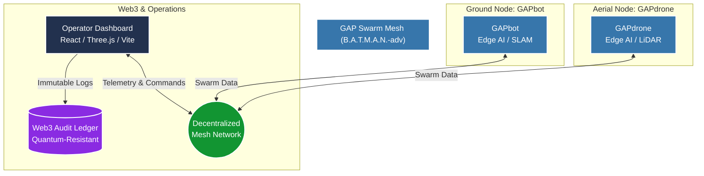
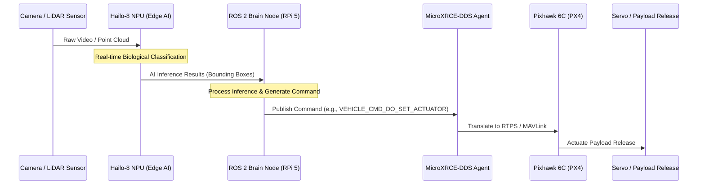

# 🏗️ GAP Ecosystem Architecture

This document provides a high-level overview of the Corax CoLAB Green Automated Platform (GAP) architecture, specifically detailing the interaction between the aerial unit (GAPdrone), ground unit (GAPbot), and the decentralized network topology.

## 🌐 System Context: Decentralized Swarm Topology

The GAP ecosystem relies on a robust, decentralized network for mission-critical operations in unstructured, remote environments. We utilize the **B.A.T.M.A.N.-adv (Better Approach To Mobile Adhoc Networking)** mesh protocol to ensure resilient, infrastructure-less communication.

## 🦅 GAPdrone: Hardware & Software Interface

The GAPdrone's internal architecture is designed around "Edge-First" principles, enabling complex AI inference and autonomous flight control locally. We utilize an asynchronous ROS 2 architecture and bridge it directly to the PX4 Autopilot using MicroXRCE-DDS.

### Key Architectural Interfaces:
1.  **AI Inference Pipeline:** High-bandwidth data flows directly from sensors to the **Hailo-8 NPU**, generating structured data (bounding boxes, classifications) for the ROS 2 environment.
2.  **ROS 2 to PX4 Bridge:** The Companion Computer (Raspberry Pi 5) communicates with the Flight Controller (Pixhawk 6C) via **MicroXRCE-DDS** over a dedicated UART link (TELEM2). This eliminates the overhead and complexities of MAVProxy, providing a streamlined, low-latency control interface.
3.  **Actuation:** High-level AI decisions are translated into specific `VEHICLE_CMD_DO_SET_ACTUATOR` commands within ROS 2, which are then reliably executed by the Pixhawk 6C to interact with the physical world (e.g., triggering the payload release mechanism).

> ⚠️ **Note:** The exact definitions of the custom ROS 2 messages (`.msg`) and services (`.srv`) can be found in the `public_interfaces` directory. Core proprietary logic executing these interfaces is maintained in Corax CoLAB's private repositories.
