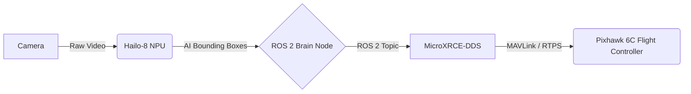
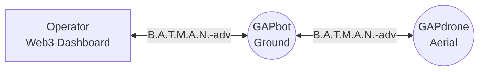

# 🚀 Corax CoLAB: Green Automated Platform (GAP) Ecosystem

*Welcome to the definitive public architectural showcase of the **Green Automated Platform (GAP)**.*

---

## 🌟 Corax CoLAB: The Vision

At **[Corax CoLAB](https://coraxcolab.com)**, our mission is to orchestrate **Intelligent Automation**. We pioneer the intersection of deep tech, biological reality, and autonomous robotics to harmonize the natural world with digital innovation. We engineer solutions that aren't just intelligent, but fundamentally ecologically sound.

Our enterprise-grade technologies empower organizations to optimize resource flows, perform critical precision agriculture (AgTech), and execute biological restoration through unprecedented automated scaling.

  
  
<i>The Future of Edge AI and Ecological Automation</i>

 

## 🧠 The GAP Ecosystem

The **Green Automated Platform (GAP)** is an overarching decentralized software and hardware ecosystem. Rather than relying on fragile cloud architectures, GAP is **Edge-First**. It leverages local high-speed SQLite databases and massive hardware acceleration to guarantee offline autonomy.

### Core Architectural Pillars:
*   **Edge AI Inference:** Real-time object detection and environmental analysis via local **Hailo-8L NPUs**. Data stays local, avoiding cloud bandwidth constraints.
*   **LiDAR-SLAM Navigation:** Generating magnificent 3D point-clouds for absolute spatial awareness.
*   **Decentralized Swarm Communication:** Agents coordinate utilizing the highly robust **B.A.T.M.A.N.-adv mesh network**, operating seamlessly in remote, unstructured environments without traditional infrastructure.
*   **Mission Control:** A powerful **React/Vite/TypeScript** dashboard featuring live WebGL/Three.js telemetry and Digital Twin visualization.
*   **Web3 Audit Ledger:** Unbreakable event logging secured by **Quantum-Resistant Cryptography** (`liboqs-python`).

<b>🛠️ Interactive: Explore the GAP Stack</b>

 

| Domain | Core Technologies |
| :--- | :--- |
| **Edge Compute** | Raspberry Pi 5 (16GB RAM), NVMe SSDs (PCIe), Hailo-8L |
| **Robotics OS** | ROS 2 (Jazzy Jalisco / Humble), MicroXRCE-DDS |
| **AI / Vision** | YOLOv8, PyTorch, OpenCV, GStreamer |
| **Networking** | B.A.T.M.A.N.-adv Mesh, Paho-MQTT, MAVLink (px4_msgs) |
| **Frontend** | React, Vite, TailwindCSS, Three.js |

 

## 🕷️ GAPbot: The Autonomous Hexapod

The physical extension of our platform for the ground floor.

**[GAPbot](./hardware/gapbot/bom.md)** is a relentless, six-legged robotic platform engineered to navigate and analyze the most challenging, unstructured terrains where wheeled systems falter. It operates entirely autonomously, acting as the ground-based sensory array for biological and environmental evaluation.

*   **Actuation:** 18 high-torque servos managed by elegant custom inverse kinematics over I2C (PCA9685).
*   **Perception:** Integrates RTK-GPS and LiDAR for precise, centimeter-level SLAM mapping while utilizing the NPU for real-time biological classification.

## 🦅 GAPdrone: The Edge AI Aerial Unit

The eye in the sky.

**[GAPdrone](./hardware/gapdrone/bom.md)** is our airborne counterpart for ecological intervention. Far from a standard drone, it carries an Edge AI payload capable of processing immense volumes of multi-spectral data locally.

*   **Autonomy:** Utilizes Pixhawk 6C flight controllers seamlessly integrated via ROS 2 Offboard Control, bypassing legacy protocols.
*   **Swarm Synergy:** Constantly communicates trajectory setpoints and AI insights back to the GAPbot via the decentralized mesh network, drastically accelerating terrain mapping and biological analysis.

 

---

## 🏗️ System Architecture

### GAPdrone Internal Data Flow

### Decentralized Mesh Topology

## 👨‍💻 Meet the Developer

### **Pelle Nyberg**
**Deep Tech Developer | AI & Robotics Innovator | Master Gardener**

With a background seamlessly spanning industrial quality management, forestry, and low-level hardware architecture, Pelle brings a holistic, highly specialized approach to AgTech and robotics.

> ⚠️ **Note:** This repository serves as a **public architectural overview, documentation hub, and AI context layer** (`docs/llms.txt`). Proprietary models (EcoMind, InnoBrain) and the complete closed-source operational stack remain in private repositories.

  

