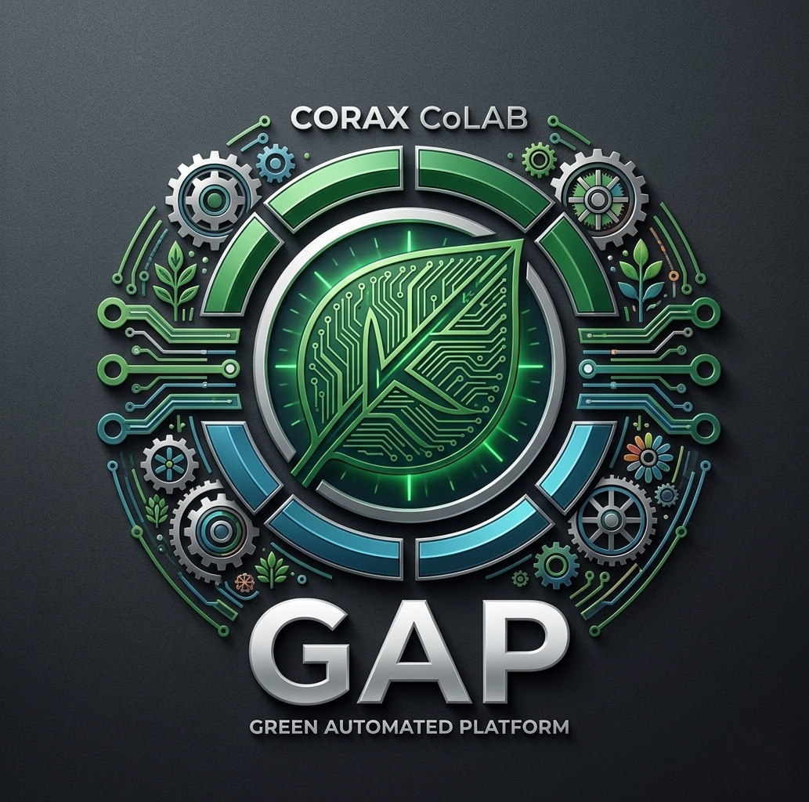
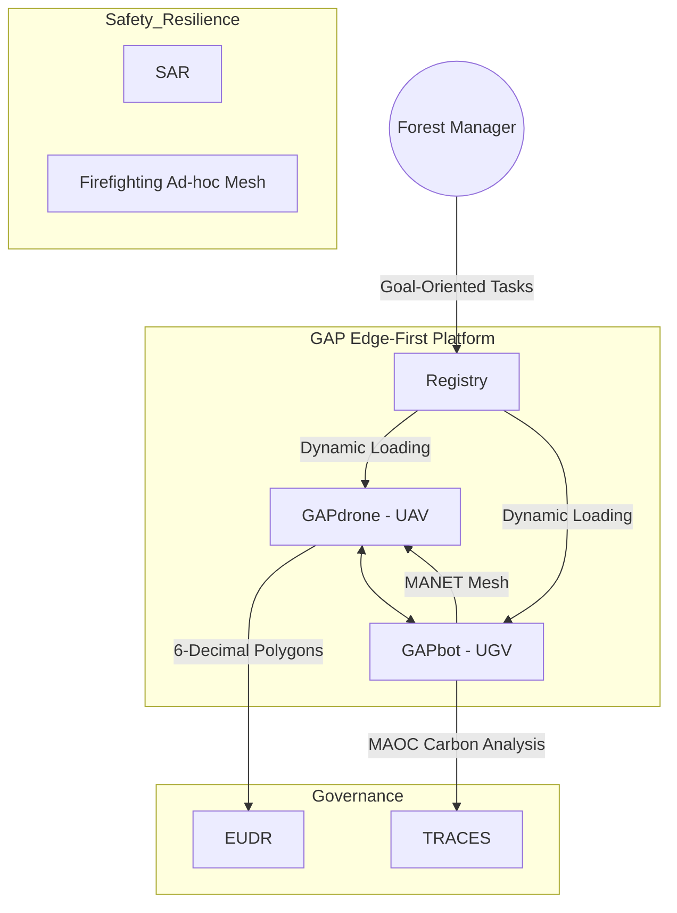
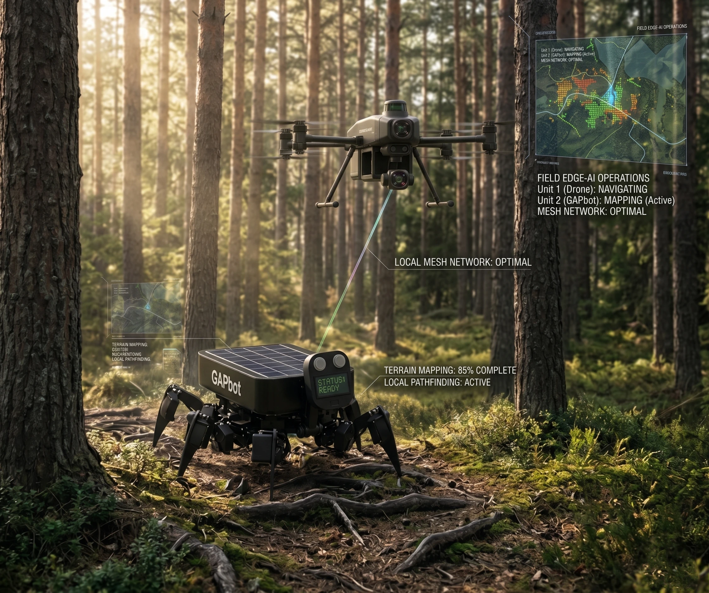
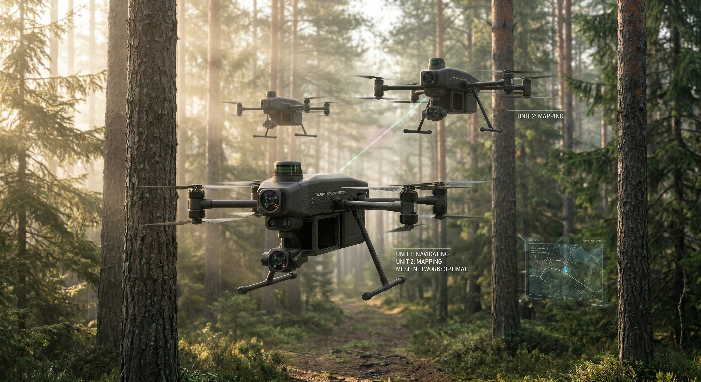
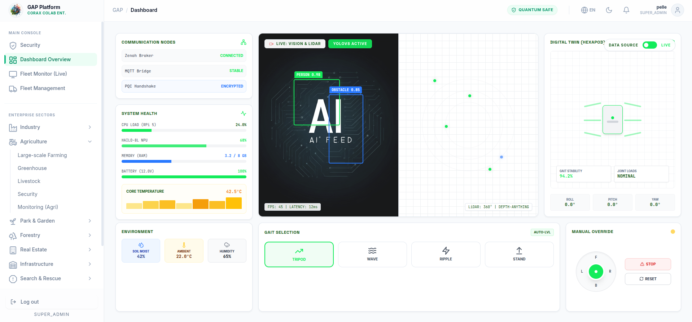

<div align="center">
  
</div>

<div align="center">

# Green Automated Platform (GAP)

[](https://github.com/PelleNybe/gap)
[](https://docs.ros.org/en/humble/index.html)
[](https://hailo.ai/)
[](https://dvc.org/)
[](https://cryptop.coraxcolab.com)
[](./LICENSE)

**Enabling a 'high degree of autonomy' (hög grad av autonomi) for a 'safer society' (ett säkrare samhälle).**

</div>

<br/>

## 💎 Project Philosophy: Open Core & Commercial Licensing

This repository serves as a **limited 'Source-Available' showcase** intended strictly for research and education.

The **Commercial Enterprise Edition** of the Green Automated Platform (GAP) is a proprietary enterprise product developed by Corax CoLAB AB that includes proprietary features such as:
- **Offline-First MANET Reconvergence**
- **3D Volumetric Biomass Estimation**
- **Hardware-Accelerated NPU Pipelines (Hailo-8)**
- **Complete EUDR API Integration**

<details open>
<summary><b>Licensing Notice</b></summary>
<br>
This project utilizes a <strong>Dual-License structure</strong>:
<ul>
  <li><strong>Proprietary Components:</strong> Core SLAM algorithms, Zero-Trust security handshakes, trained ML models (e.g., custom YOLO weights), and proprietary business logic are strictly protected under <strong>Copyright (c) 2026 Corax CoLAB AB</strong>.</li>
  <li><strong>Public Interfaces:</strong> Documentation and public interface stubs available in this repository are licensed under a permissive <strong>MIT License</strong>.</li>
</ul>
</details>

<br/>

<div align="center" style="background-color: #1a1a1a; padding: 20px; border-radius: 8px; border: 1px solid #333;">
  <h3>🚀 Ready for Enterprise Deployment?</h3>
  <p>Commercial entities, enterprise partners, and investors looking for licensing, deep-tech professional consulting services, or implementation are encouraged to direct commercial inquiries to info@coraxcolab.com.</p>
  <a href="mailto:info@coraxcolab.com"></a>
  <a href="https://coraxcolab.com"></a>
</div>

---

## 🚀 The Unfair Advantage
The GAP ecosystem combines decentralized edge computing with rigorous compliance and resilient offline networking, providing an "Unfair Advantage" in mission-critical environments.

## 🏛️ System Architecture

Our 'Edge-First' decentralized architecture leverages real-time AI inference locally via Hailo-8L NPUs to maintain true offline autonomy.

### ⚡ The Full-Stack of Matter: Hardware & Edge Computing
* **Decentralized Intelligence:** Powered by an extremely powerful local stack featuring a Raspberry Pi 5 (16 GiB RAM) with active cooling.
* **AI Acceleration:** Integrated Hailo-8 and Hailo-8L NPUs connected via PCIe enable heavy neural networks directly on the edge.
* **Lightning-Fast Storage:** NVMe SSD (1TB) connected via USB 3.1 or PCIe ensures rapid data storage and access, even in demanding field conditions.


> **Hardware Critical Note**: To prevent system brownouts during intensive Hailo-8 NPU inference tasks, the Raspberry Pi 5 **MUST** use a dedicated 5V/5A BEC and have `usb_max_current_enable=1` set in `/boot/firmware/config.txt`.



<div align="center" style="border-radius: 12px; box-shadow: 0 4px 8px rgba(0,0,0,0.1); overflow: hidden; margin: 20px 0;">
  
  <p><i>The autonomous GAPbot and GAPdrone operating synergistically in a forest environment.</i></p>
</div>

<div align="center" style="border-radius: 12px; box-shadow: 0 4px 8px rgba(0,0,0,0.1); overflow: hidden; margin: 20px 0;">
  
  <p><i>The autonomous GAPbot surveying unstructured biological terrains.</i></p>
</div>

<div align="center" style="border-radius: 12px; box-shadow: 0 4px 8px rgba(0,0,0,0.1); overflow: hidden; margin: 20px 0;">
  
  <p><i>The GAPdrone swarm coordinating via B.A.T.M.A.N.-adv mesh network.</i></p>
</div>

<div align="center">
  <p><i>The GAP Ecosystem Architecture: Highlighting the data flow from Edge Sensors to Web3 Audit Ledgers.</i></p>
</div>

<div align="center" style="border-radius: 12px; box-shadow: 0 4px 8px rgba(0,0,0,0.1); overflow: hidden; margin: 20px 0;">
  
  <p><i>The React/Vite based Mission Control dashboard displaying live telemetry and 3D digital twin visualization.</i></p>
</div>


### 🌲 Forestry Dominance 2026: Autonomy in Biological Environments
* **Kinematics & Navigation:** GAPbot utilizes "Split-Belly Stability" combined with ROS 2 Jazzy Jalisco to navigate unstructured and difficult terrain in biological environments.
* **3D Volumetric Biomass Estimation:** Uses FAST-LIO2 for precise mapping and volume calculation of standing forests.
* **Multispectral Analysis:** Early pest detection and forest health monitoring via NDRE and GNDVI indices.
* **Visual & Bioacoustic AI:** 360-degree visual trunk inspection, and built-in bioacoustic models identify and protect red-listed species in real-time.

### 🧬 The GAP Pipeline
The system utilizes sequential, high-speed pipelines. For example, the GAPdrone's internal pipeline flows:
**Camera** ➡️ **Hailo-8 NPU** ➡️ **ROS 2 Brain Node** ➡️ **MicroXRCE-DDS** ➡️ **Pixhawk 6C Flight Controller**


### 🔋 Off-Grid Networking & Energy Management
* **B.A.T.M.A.N.-adv Mesh & CBBA:** The swarm communicates via a decentralized mesh network and distributes tasks autonomously using the CBBA algorithm, completely independent of the internet.
* **Sun Bathing Mode:** A unique battery-saving mode where GAPbot shuts down its motors and enters MPPT solar charging, but keeps the NPU awake to function as a passive, listening sensor node.

### 🤖 LLM Mission Goal Structure
The NLP pipeline translates human intents into structured JSON representations. The system converts these intents into actionable kinematic waypoints for the swarm coordinators.
```json
{
  "mission_id": "msn_alpha_092",
  "priority": "high",
  "agent_targets": ["drone_1", "drone_2", "hexapod_1"],
  "objectives": [
    {
      "type": "scout_area",
      "parameters": {
        "bounding_box": {
          "north_west": {"lat": 59.3293, "lon": 18.0686},
          "south_east": {"lat": 59.3280, "lon": 18.0700}
        },
        "altitude_m": 35.0,
        "search_pattern": "lawnmower"
      }
    }
  ]
}
```


---


## 🛡️ Rigorous Quality Assurance

The GAP system operates in mission-critical environments. To ensure absolute reliability and safety, the system has successfully passed a comprehensive **Master System Audit 2026**. This audit verifies:
- Strict **hardware-software parity** across all deployed edge devices.
- Full compliance with the upcoming **EU AI Act**, ensuring transparent and accountable autonomous operations.
- Implementation of industry best practices for reproducible AI using **DVC (Data Version Control)**.
- Adherence to our [Inclusive Design Guidelines](./INCLUSIVE_DESIGN_GUIDELINES.md) for 2026 HRI Standards.

---

## 🌍 2026 Regulatory Readiness

Corax CoLAB is fundamentally committed to ethical innovation and rigorous regulatory compliance, specifically aligned with upcoming 2026 mandates like the EU Deforestation Regulation (EUDR).

*   **Horizon Europe & Vinnova Standards:** We are fully compliant with Horizon Europe and Vinnova standards.
*   **Gender Equality Plan:** View our formal <a href="https://coraxcolab.com/gep">Gender Equality Plan</a>.
*   **Community Standards:** Please review our [CODE_OF_CONDUCT.md](./CODE_OF_CONDUCT.md) and [CONTRIBUTING.md](./CONTRIBUTING.md).
*   **First-Mile Traceability:** Ensuring immutable polygon mapping for plots exceeding 4 hectares via Web3 Audit Ledgers.

* **Compliance-as-Code:** Automated data streams directly to the EU's TRACES system for full EUDR/CSRD compliance.
* **Swedish Forestry Standard:** Complete integration of Biometria's classification matrix for sawlogs and pulpwood, and data transfer to VIOL 3 via the papiNet standard.
* **Machine Communication:** Support for the global XML standard StanForD 2010 to export digital stamping records directly to harvesters and forwarders in the forest.
* **Security & Crypto:** Data is immutably encrypted on-edge via quantum-safe blockchain technology (Post-Quantum Cryptography, liboqs-python). The software exposes CycloneDX SBOMs for the Cyber Resilience Act (CRA) and complies with the EU Machinery Regulation with PL d-compatible E-stops for safe human-robot collaboration.


---

## 🔬 Repository Highlights

Explore the technical showcases available in this public repository:

<details>
<summary><b>🔒 gap_zero_trust</b></summary>
<br>
Showcases our approach to cyber-secure Edge AI and Zero-Trust architecture, crucial for protecting high-bandwidth sensor data and ensuring operational telemetry in heavy manufacturing (Industry 5.0).
</details>

<details>
<summary><b>🗺️ core_slam</b></summary>
<br>
Demonstrates the integration of advanced sensor fusion (3D-LiDAR and thermal imaging) for autonomous navigation and infrastructure inspections in GPS-denied environments.
</details>

<details>
<summary><b>🚁 gapdrone_edge_ai</b></summary>
<br>
Highlights the airborne Edge AI unit used for ecological interventions (e.g., autonomous seed pod deployment), tactical deployment, and continuous swarm coordination over a B.A.T.M.A.N.-adv mesh network.
</details>

---

## 👨‍💻 Meet the Developer

<div align="center">


### **Pelle Nyberg**
**Deep Tech Developer | AI & Robotics Innovator | Master Gardener**

[](https://github.com/PelleNybe)
[](https://www.linkedin.com/in/pellenyberg/)
[](https://pellenybe.github.io)
[](https://cryptop.coraxcolab.com)
[](https://coraxcolab.com)

</div>

<div align="center">
  
</div>
