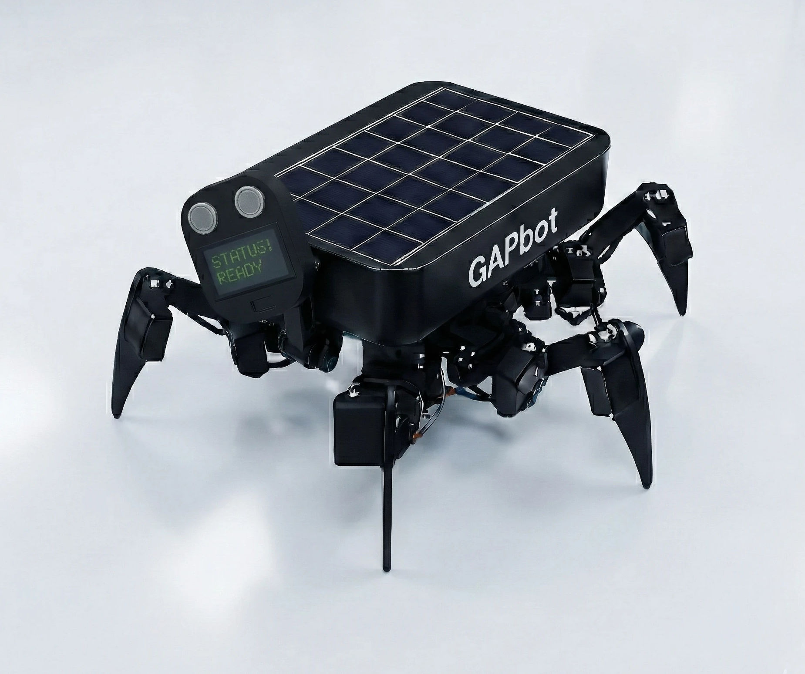

# 🚀 Corax CoLAB: Green Automated Platform (GAP)
**Intelligent Automation for the Physical World**

*Welcome to the definitive public architectural showcase of the **Green Automated Platform (GAP)**.*

---

## 🌟 Vision & Use Case

At **[Corax CoLAB](https://coraxcolab.com)**, we are pioneering the intersection of Deep Tech, biological reality, and autonomous robotics. The **Green Automated Platform (GAP)** ecosystem is engineered to execute **Autonomous Ecological Restoration** and **Precision Forestry** at an unprecedented scale. By deploying swarms with a **"high degree of autonomy"**, the GAP ecosystem is designed to mitigate environmental risks and actively contribute to a **"safer society"**.

By leveraging cutting-edge Edge AI and decentralized swarm robotics, GAP solves the critical challenge of **"first-mile traceability"** for the **EU Deforestation Regulation (EUDR)**. Our platform ensures verifiable, immutable environmental impact data through the integration of **Web3 Audit Ledgers** and advanced Edge AI telemetry.

  
  
<i>The Future of Edge AI and Ecological Automation</i>

### 🌍 Strategic Verticals
The GAP ecosystem is architected to address critical challenges across four primary sectors:

<b>🏭 Industry: Manufacturing & Heavy Industry</b>

 
Driving the transition towards <strong>Industry 5.0</strong> and circular factories, the GAP platform integrates cyber-secure Edge AI and <strong>Zero-Trust architecture</strong> to enable real-time decision support and resilient automation. By processing high-bandwidth sensor data directly on the Hailo-8 NPU, the system provides instantaneous anomaly detection and operational telemetry, optimizing heavy manufacturing workflows without relying on vulnerable cloud uplinks.

<b>🌉 Infrastructure: Smart Cities & Energy</b>

 
Ensuring societal resilience and a robust energy supply, GAP facilitates autonomous infrastructure inspections across critical assets like power grids and pipelines. Utilizing advanced sensor fusion—combining 3D-LiDAR and thermal imaging—the swarm rapidly assesses structural integrity and storm damage. This immediate, high-fidelity data acquisition eliminates human risk in hazardous environments and accelerates disaster recovery.

<b>🛡️ Emergency Response: Dual-Use & Defense</b>

 
Engineered for <strong>Dual-Use</strong> applications, GAP provides tactical superiority in protecting critical civil infrastructure. Our decentralized <strong>B.A.T.M.A.N.-adv mesh network</strong> ensures uninterrupted swarm communication and coordination in GPS-denied, electronically jammed, or communication-compromised environments. This robust topology is mission-critical for Search-and-Rescue (SAR) operations, disaster management, and complex defense scenarios where traditional comms fail.

<b>🌲 Agritech: Precision Forestry & Ecological Restoration</b>

 
At its core, GAP revolutionizes Precision Forestry and autonomous ecological restoration. The drone swarm executes targeted biological interventions, such as autonomous seed pod deployment via precision servos. Crucially, the platform guarantees <strong>EUDR first-mile traceability</strong>, generating immutable polygon mapping for plots exceeding 4 hectares and anchoring this geospatial intelligence directly to Web3 Audit Ledgers for absolute regulatory compliance.

### 🔄 The LOOP Method: Our 5-Phase Implementation Plan
Corax CoLAB operates on a continuous improvement model, ensuring our robotic solutions deliver long-term value (LTV/CAC of 2.9). Our methodology follows a strict 5-phase plan for deploying the GAP ecosystem:

1.  **Phase 1: Deep Tech Consultation & Alignment:** Strategic partnership to define edge AI and Web3 integration requirements for regulatory compliance (e.g., EUDR, CSRD).
2.  **Phase 2: Digital Twin Simulation:** Utilizing 4D simulation to model complex kinematics and mission parameters before physical deployment, reducing field errors.
3.  **Phase 3: Edge-First Deployment:** Installing the autonomous GAP drone or GAPbot with local SLAM and Hailo-8 NPU inference, completely independent of cloud architecture.
4.  **Phase 4: Swarm Intelligence Coordination:** Enabling B.A.T.M.A.N.-adv mesh networking and CBBA task allocation for seamless multi-agent operations.
5.  **Phase 5: Immutable Audit & LOOP Refinement:** Securing data via Quantum-Resistant Web3 Ledgers and utilizing findings to iteratively optimize ('LOOP') the system's performance and efficiency.

---

## 🛠️ Technology Stack

GAP is an **Edge-First** ecosystem. Rather than relying on fragile cloud architectures, our systems execute complex inferences locally, ensuring total operational autonomy even in disconnected, unstructured environments.

### 🦅 Hardware Integration (GAPdrone & GAPbot)
Our edge units are built upon industrial-grade, mission-critical hardware engineered for high efficiency:
*   **Companion Computer:** Raspberry Pi 5 (16GB RAM)
*   **Edge AI Acceleration:** Hailo-8L NPU (**26 TOPS** for ultra-low latency real-time biological classification)
*   **Efficiency Benchmark:** Industry-leading **TOPS/Watt** ratio, enabling prolonged 'Sun Bathing Mode' and extreme field endurance without thermal throttling or rapid battery depletion.
*   **Flight Controller (GAPdrone):** Holybro Pixhawk 6C
*   **Frame (GAPdrone):** Holybro X650

### 🧠 Software Architecture
*   **Core Middleware:** Asynchronous **ROS 2 (Humble)** architecture.
*   **Flight Control Bridge:** Seamless telemetry and command execution via **MicroXRCE-DDS** directly bridging ROS 2 and PX4 Autopilot, bypassing legacy MAVProxy constraints.
*   **Networking:** Robust decentralized swarm communication using **B.A.T.M.A.N.-adv** mesh networking.

 

> ⚠️ **Note:** This repository serves as a **public architectural overview, documentation hub, and AI context layer**. Proprietary business logic, core SLAM algorithms, trained ML models (e.g., custom YOLO weights), and Zero-Trust Security handshakes remain in Corax CoLAB's private enterprise repository.

---

## 👨‍💻 Meet the Developer

### **Pelle Nyberg**
**Deep Tech Developer | AI & Robotics Innovator | Master Gardener**

  

