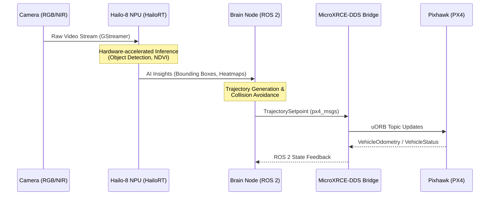

# Public Architecture Export: GAPdrone & GAPbot Swarm

This document provides a high-level overview of the system architecture, specifically focusing on the ROS 2 communication layer, edge AI data flow, and mission command structures.

## 1. ROS 2 Node Communication (Flight Control)

The autonomous flight system utilizes modern ROS 2 and MicroXRCE-DDS middleware to communicate directly with the flight controller (Pixhawk), bypassing legacy protocols like MAVLink. The `autonomous_flight_director` node manages offboard control.

### Key Topics and Message Types

*   **Topic:** `/fmu/in/vehicle_command`
    *   **Message Type:** `px4_msgs/msg/VehicleCommand`
    *   **Description:** Used to send direct commands to the flight controller, such as arming, disarming, and mode switching (e.g., entering Offboard mode).
*   **Topic:** `/fmu/in/trajectory_setpoint`
    *   **Message Type:** `px4_msgs/msg/TrajectorySetpoint`
    *   **Description:** Transmits high-rate positional, velocity, and acceleration setpoints to the Pixhawk during offboard flight.
*   **Topic:** `/fmu/in/offboard_control_mode`
    *   **Message Type:** `px4_msgs/msg/OffboardControlMode`
    *   **Description:** Signals the active offboard control axes (position, velocity, acceleration, attitude, body rates) required to maintain the flight mode.
*   **Topic:** `/fmu/out/vehicle_odometry`
    *   **Message Type:** `px4_msgs/msg/VehicleOdometry`
    *   **Description:** Receives high-fidelity state estimation (position, orientation, velocity) from the flight controller's EKF.
*   **Topic:** `/fmu/out/vehicle_status`
    *   **Message Type:** `px4_msgs/msg/VehicleStatus`
    *   **Description:** Provides critical system health, arming state, and current flight mode information.

## 2. Hardware Data Flow: Edge AI to Flight Controller

The system leverages a specialized NPU (Neural Processing Unit) to handle high-bandwidth sensor data without bottlenecking the main companion computer CPU.



## 3. Abstracted LLM Mission Goal Structure

The NLP pipeline translates human intents into structured JSON representations. The `GslTranslator` converts these intents into actionable kinematic waypoints for the swarm coordinators (`multi_agent_coordinator`).

```json
{
  "mission_id": "msn_alpha_092",
  "priority": "high",
  "agent_targets": ["drone_1", "drone_2", "hexapod_1"],
  "objectives": [
    {
      "type": "scout_area",
      "parameters": {
        "bounding_box": {
          "north_west": {"lat": 59.3293, "lon": 18.0686},
          "south_east": {"lat": 59.3280, "lon": 18.0700}
        },
        "altitude_m": 35.0,
        "search_pattern": "lawnmower"
      }
    },
    {
      "type": "identify_anomalies",
      "parameters": {
        "target_classes": ["unauthorized_vehicle", "thermal_hotspot"],
        "confidence_threshold": 0.85
      }
    }
  ],
  "failsafe_policy": {
    "on_comms_loss": "return_to_launch",
    "on_low_battery": "land_nearest_safe_zone"
  }
}
```
